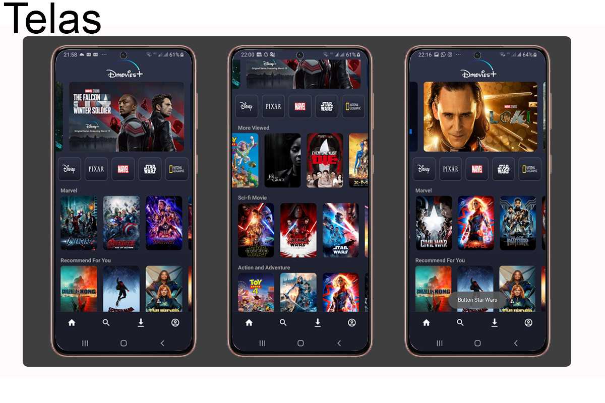

# Dmovies App in Kotlin 

Hello welcome

This is a Disney plus clone app developed with the purpose of putting into practice the knowledge acquired after finishing Everis Bootcamp at DIO.

In this app, I used concepts like nested recyclerView, custom buttons, bottomBar, toolBar, and others.

Feel free to look, I am open to tips and suggestions.

# Screens

